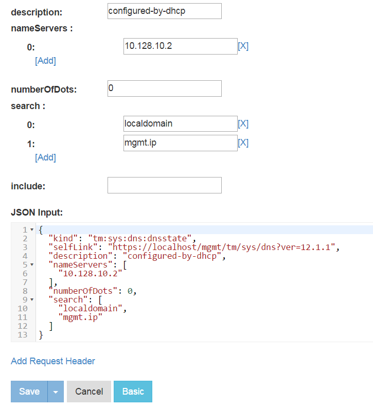
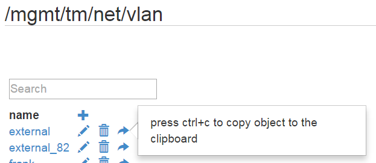
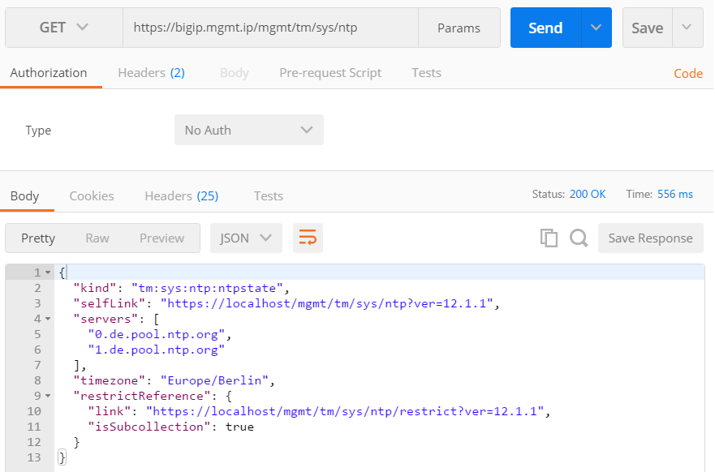

How to use
==========

Create a JSON Blob manually
---------------------------

To generate your own json blob file, you should start from an already configured element on a BIG-IP and read it out over REST to past the result on the new created empty file. It is important to understand, that you only can use single elements as a result of the REST call. There are no lists allowed.

How to get REST content
~~~~~~~~~~~~~~~~~~~~~~~

It is recommanded to use a REST Browser like Postman to send REST calls towards the BIG-IP. On console also curl should be fine and since we are doing only GET requests here, also a normal browser will do.
 
If you are new to REST, you should start with the following call to get an index and start from there:

	https://bigip.mgmt.ip/mgmt/tm

To get more background of the structure I would recommend the tmsh reference guide which you can download from https://support.f5.com. The REST API structure is mainly adapted from the tmsh structure.

Since v12 you can also browse on the BIG-IP directly over the REST API:

	https://bigip.mgmt.ip/mgmt/toc

For example, if you would like to get the DNS setup of the BIG-IP follow the link sys followed by the link /mgmt/tm/sys/dns. To get the REST content you need now to click on Edit and Advanced:

Now you can copy past the JSON code in the jb file.

If you have some lists, you can also copy the JSON code towards the clipboard via the right arrow, as you can see on this vlan list.

Add the content to the json blob file
~~~~~~~~~~~~~~~~~~~~~~~~~~~~~~~~~~~~~

After you have been able to get the JSON configuration of the target element,
you can copy past the JSON code into the json blob (jb) file.

If you would like to collect several objects in the same jb file, you simple can past them in but they need to be separated by an empty line. I choose an empty line as separates, since it is easy to parse and also it improves the readability of the jb file. As a result of this, it is not allowed to put any empty lines within the JSON object, even if it would be allowed by JSON.

As an example we will add next the ntp setup of the BIG-IP. We simply take the configuration from the path /mgmt/tm/sys/ntp. And this time we will use postman for that:

How to change just one property
~~~~~~~~~~~~~~~~~~~~~~~~~~~~~~~

So far we take one object and completely overwrite the configuration of the target system with it. But sometimes we would like to change just one property of the object. Just imagen, you would like to set the hostname of the BIG-IP, this can be done in the /mgmt/tm/sys/global-settings:

	{
	  "kind": "tm:sys:global-settings:global-settingsstate",

	  "selfLink": "https://localhost/mgmt/tm/sys/global-settings?ver=12.1.1",

	  "awsApiMaxConcurrency": 1,

	  "consoleInactivityTimeout": 0,

	  "customAddr": "none",

	  "failsafeAction": "go-offline-restart-tm",

	  "fileBlacklistPathPrefix": "{/shared/3dns/} {/shared/bin/} {/shared/core/} {/shared/datasync/} {/shared/em/} {/shared/GeoIP/} {/shared/images/} {/shared/lib/} {/shared/lib64/} {/shared/log/} {/shared/lost+found/} {/shared/mgmt/} {/shared/nfb/} {/shared/ssh/} {/shared/statsd/} {/shared/tmstat/} {/shared/vadc/} {/config/aaa/} {/config/big3d/} {/config/bigip/} {/config/filestore/} {/config/gtm/} {/config/httpd/} {/config/ntp.conf} {/config/rndc.key} {/config/ssh/} {/config/ssl/}",

	  "fileBlacklistReadOnlyPathPrefix": "{/etc/shadow}",

	  "fileLocalPathPrefix": "{/shared/} {/tmp/}",

	  "fileWhitelistPathPrefix": "{/var/local/scf} {/tmp/} {/shared/} {/config/} {/usr/share/aws/}",

	  "guiSecurityBanner": "enabled",

	  "guiSecurityBannerText": "Welcome to the BIG-IP Configuration Utility.\n\nLog in with your username and password using the fields on the left.",

	  "guiSetup": "disabled",

	  "hostAddrMode": "management",

	  "hostname": "bigip04.local",

	  "lcdDisplay": "enabled",

	  "ledLocator": "disabled",

	  "mgmtDhcp": "disabled",

	  "netReboot": "disabled",

	  "passwordPrompt": "Password",

	  "quietBoot": "enabled",

	  "usernamePrompt": "Username"
	}
	

As you can see we have several properties in this configuration we not want to touch. In this case remove all the properties from the list except the selfLink and the one property you would like to change. Don't forget to remove the finishing comma at the last line!

        {
          "selfLink": "https://localhost/mgmt/tm/sys/global-settings?ver=12.1.1",

          "hostname": "bigip04.local"
        }
	

The selfLink is important to get the location of the target object and if there is only one additional property in the object, the script will automatically change only this one property.

Next the object can be added to the jb file, as well separated by an empty line.

